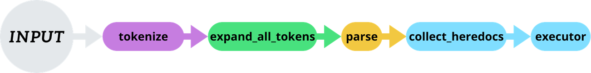

*This project has been created as part of the 42 curriculum by zotaj-di, baelgadi.*

<p align="center">
  
</p>

# Description

MiniDevil is a POSIX inspired shell written in C as part of the 42 school minishell project.\
It reads commands from the terminal, tokenizes & parses them into an AST (Abstract Syntax Tree) then executes the tree: handling pipes, redirections, environment variables and more, just like bash.

## Features

### ➤ Mandatory

- Interactive prompt with command history (readline)
- PATH based executable search and absolute OR relative path execution
- Single and double quote handling:
  - `'` prevents all interpretation
  - `"` allows for `$` expansion
- Redirections:
  - `<` (input)
  - `>` (output)
  - `>>` (append)
  - `<<` (heredoc)
- Pipes (`|`) connecting STDOUT to STDIN across commands
- Environment variable expansion (`$VAR`, `$?` ...)
- Signal handling:
  - `CTRL C` (new prompt)
  - `CTRL D` (exit)
  - `CTRL \` (ignored)
- Builtins: `echo`, `cd`, `pwd`, `export`, `unset`, `env`, `exit`

### ➤ Bonus

- `&&` and `||` operators
- Parentheses `()` for subshell
- Wildcard `*` globbing (in the current directory)

## Instructions

### ➤ Requirements

- GCC or CC compiler
- GNU Make
- readline library (`libreadline-dev` on Debian/Ubuntu)

### ➤ Build

```sh
# Mandatory part
make

# Bonus part
make bonus
```

### ➤ Run

```sh
./minishell

# UI Mode (extra, not in subject)
./minishell --ui
```

### ➤ Clean

```sh
make clean    # remove object and dependency files
make fclean   # clean + remove binary
make re       # full rebuild
```

## Architecture

### ➤ Mandatory

<p align="center">
  
</p>

### ➤ Bonus

<p align="center">
  
</p>

Further information is provided in the documentation.

## Documentation

### ➤ Doxygen

The mandatory part is fully documented with Doxygen.

You can generate it directly:
```sh
make doc
open doc/html/index.html
```

Or [follow this link](https://baderelg.github.io/42docs/Minishell/)

### ➤ More documentation

- [(Notion) Bonus part explained w/ examples](https://www.notion.so/Bonus-explanation-31eadb744e9680498e2bd7db28c22969)
- [(Notion) External functions explained](https://www.notion.so/External-functions-explained-2b5adb744e96801d8e9efbc09126560a) (breakdown of every allowed external function)

## Resources

- [Bash Reference Manual (GNU)](https://www.gnu.org/software/bash/manual/bash.html)
- [GNU Readline Library](https://tiswww.case.edu/php/chet/readline/rltop.html)
- [Valgrind Memcheck: Different ways to lose your memory](https://developers.redhat.com/blog/2021/04/23/valgrind-memcheck-different-ways-to-lose-your-memory)

### ➤ AI usage

AI tools (Claude) were used during this project for:
- Debugging assistance and code review
- Better understand core concepts and some edge cases
- Acting as a rubber duck colleague (making sure the Doxygen comments and pages were understandable and accurate)
- Greatly improved documentation by helping correct and refine it (Doxyfile & Doxygen xml/css/shell script)
- Helping structure the bonus architecture in an efficient way

## Authors

- **zotaj-di** — [42 intra](https://profile.intra.42.fr/users/zotaj-di) | [GitHub](https://github.com/L3awdMan)
- **baelgadi** — [42 intra](https://profile.intra.42.fr/users/baelgadi) | [GitHub](https://github.com/baderelg)
